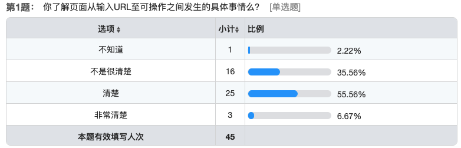
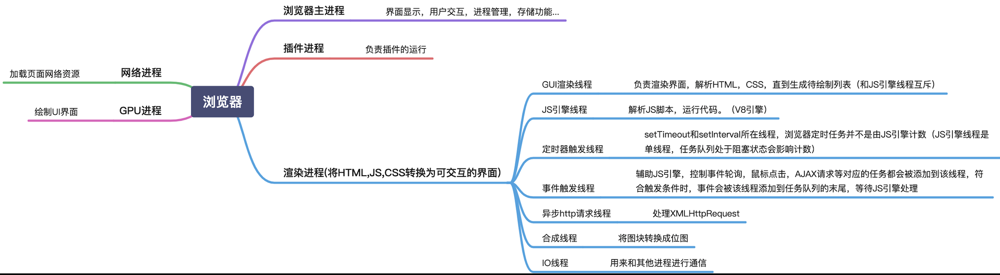
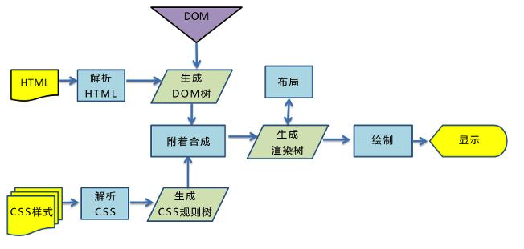
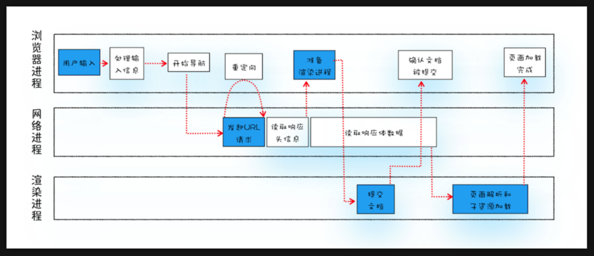
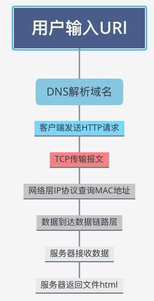
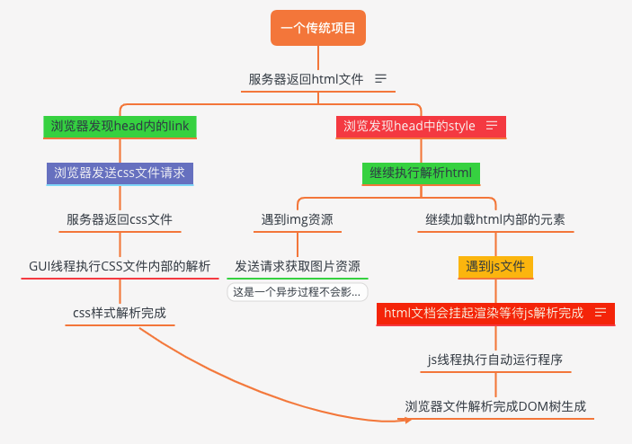
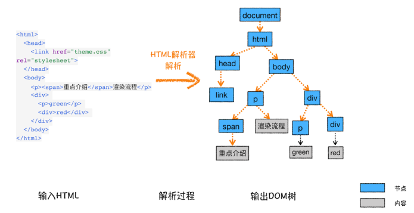
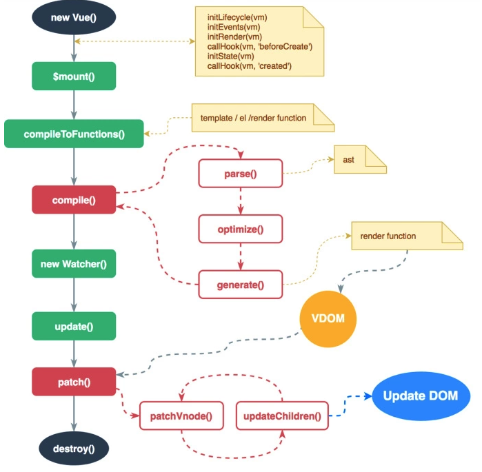
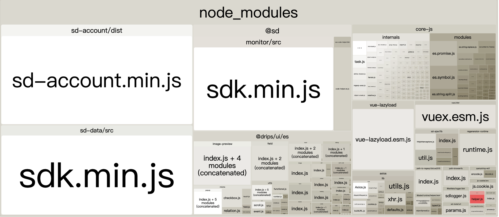
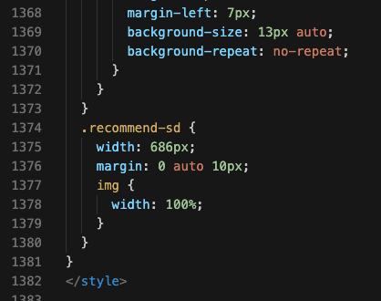

## 性能优化-主要链路分析

在分享之前我们看一个问卷调查：

**目的** 

1. 掌握浏览器从输入 URL之后到埋点上报之间的发生的事情。
2. 头脑风暴性能优化方案。

**计划**

1. 区分可见和可操作。
2. 页面输入URL之后的流程。
3. 性能优化可行性优化总结和收益

**开始**

## 1. 可见和可操作。

我们做性能优化的目的是提高可见可操作性，如果我们把这两个词一起弄就会有写麻烦，其实我们可以拆开来做。

可见：

个人理解：在单页面中可见是前端进入模版年代的一个重要指标，因为用户在打开网页的时候能看到的就是一个空的`

`标签，之后要等待选用框架的模版执行完毕注入到页面之后才算完成可见。

可操作：

个人理解：用户可以和我们的页面重要功能进行无阻碍交互。

现状：

2. 页面可见可操作时间接近。
3. 用户首次打开页面白屏时间明显。

## 2. 页面输入URL之后的流程。

> **进程：**

如一个程序的功能，如果和线程对比可以说事线程的父母。

**浏览器的进程:**

**1、浏览器进程**
浏览器最核心的进程，负责管理各个标签页的创建和销毁、页面显示和功能（前进，后退等）、网络资源的管理，下载等。

**2、插件进程**
负责每个第三方插件的使用，每个第三方插件使用时候都会创建一个对应的进程。

**3、GPU进程**
负责3D绘制和硬件加速。

**4、渲染进程**
渲染进程就是我们常说的浏览器内核，我们每开启一个tab时就会开启一个渲染进程。

-------------------------

> **线程:**

类似程序中的一个任务，类似父母怀抱中的孩子。

**浏览器中的线程(浏览器内核渲染进程的多线程)**

浏览器内核就是浏览器渲染进程，从接收http文件后再到呈现整个页面的过程，由浏览器渲染进程负责的。浏览器内核是多线程的，在内核控制下各线程相互配合来渲染页面，一个浏览器通常由以下常驻线程组成：

**1、GUI 渲染线程**
GUI 渲染线程负责渲染页面

1、解析HTML文件，构建DOM树，同时浏览器主进程负责下载CSS文件

2、CSS文件下载完成，解析CSS文件成树形的数据结构，然后结合DOM树合并成RenderObject树

3、布局RenderObject树，负责RenderObject树中的元素的尺寸，位置等计算

4、绘制RenderObject树，绘制页面的像素信息

5、浏览器主进程将默认的图层和复合图层交给GPU进程，GPU进程再将各个图层合成（conposite），最后显示出页面

**2、JS 引擎线程**
JS 引擎，也可以称为JS内核，主要负责负责解析并运行 JavaScript 代码。

**3、定时器线程**
浏览器定时计数器并不是由 JavaScript 引擎计数的，因为 JavaScript 引擎是单线程的，如果处于阻塞线程状态就会影响记计时的准确，因此通过单独线程来计时并触发定时。

**4、事件触发线程**
事件触发线程和EventLoop相关，当一个事件被触发时该线程会把事件添加到EventLoop中，等待JS引擎进行处理。由于JS是单线程异步的，所以这些事件都得排队等待JS引擎处理。

**5、XHR请求线程**
XMLHttpRequest请求触发与浏览器事件触发不同，XHR请求是通过浏览器新开一个线程请求， 将检测到状态变更时，执行回调函数。

### 浏览器输入URL

------------

**处理输入信息**

1. 检查用户输入

2. beforeunload事件

3. 浏览器进入加载状态

**URL 请求过程**

4.发送到网络进程

5.检查缓存

6.DNS解析

7.通过TCP三次握手建立连接

8.发送请求

9.服务器响应

10.是否断开连接

11.解析响应头（重定向、响应数据类型处理）

### 

浏览器收到服务器返回的内容:

浏览器渲染

**线程之间的互斥：**

**GUI线程**和**JS引擎线程**是互斥的，这是为了防止一边通过js修改元素属性，一边渲染页面，而导致渲染出现不可预期的结果。

当 JavaScript 引擎执行时 GUI 线程会被挂起， GUI 更新会被保存在一个队列中等到引擎线程空闲时立即被执行。

更进一步理解：

- JS 会阻塞后续 DOM 解析以及其它资源(如 CSS，JS 或图片资源)的加载。（项目中是把js放到html的结尾，整个DOM树都被解析完成之后在开始执行代码)

  **因此：**

  > 直接引入的 JS 会阻塞页面的渲染（GUI 线程和 JS 线程互斥）
  >
  > 异步加载的 JS （script 标签中添加 defer 属性）不阻塞页面的解析
  >
  > 异步加载的 JS （script 标签中添加 async 属性）下载过程不阻塞页面的解析，下载完成后立即执行，执行过程会阻塞页面的解析

  **JS就是个霸王**

  

- CSS不阻塞DOM的加载和解析（它只阻塞DOM的渲染呈现。这里谈加载），不会阻塞其它资源(如图片)的加载，但是会阻塞 后续JS 文件的执行（原因之一是，js执行代码可能会依赖到css样式。css只阻塞执行而不阻塞js的加载）。

  **一句话**：

  > CSS会影响JS文件的执行。但是JS可以正常加载。		
  >
  > CSS 放在 head 中会阻塞页面的渲染（页面的渲染会等到 css 加载完成）
  >
  > CSS 阻塞 JS 的执行 （因为 GUI 线程和 JS 线程是互斥的，因为有可能 JS 会操作 CSS）
  >
  > CSS 不阻塞外部脚本的加载（不阻塞 JS 的加载，但阻塞 JS 的执行，因为浏览器都会有预先扫描器）		

  **注意:**

  对于一个HTML文档来说，不管是内联还是外链的css，都会阻碍后续的dom渲染，但是不会阻碍后续dom的解析。

  当css文件放在中时，虽然css解析也会阻塞后续dom的渲染，但是在解析css的同时也在解析dom，所以等到css解析完毕就会逐步的渲染页面了。

  > **其中容易发生回流（reflow）**
  >
  > 当浏览器发现某个部分发生了点变化影响了布局，需要倒回去重新渲染，内行称这个回退的过程叫 reflow。reflow 会从 这个 root frame 开始递归往下，依次计算所有的结点几何尺寸和位置。
  >
  > 重绘和重排版是负担很重的操作，可能导致网页应用的用户界面失去相应
  >
  > 因为我们是Vue项目所以这个对我们影响不是很大他们都是在 Vnode中完成的。

  

在开始之前有一个问题： onload 和 mounted 谁先执行了？

一个Vue文件解析的过程：

当我们Vue把解析好的html注入到 DOM中浏览器又开始重新执行渲染，浏览器执行的速度是很快的在7-20ms之内就可以完成。

也就是说我们性能优化的重点在Vue解析这一块。

## 3. 什么影响可见可操作

1. 影响可见的因素很简单就是我们打包关键性文件的大小这直接影响我们的下载速度。
2. 在我们埋点上报前我们写的业务代码量。

**举个例子：**

dist/js/chunk-vendor.js

这个文件基本主要包含：

  

其中有三巨头 ：

sd-account 账户中心 27.52KB	

sd-data 数据埋点 25.96KB

sdk-monitor 性能监控 22.97KB

这是我们完整项目必须要有的3个文件。

其余小弟：

drips/ui 17KB

core.js 17.39KB

....

剩下的这些文件大小是可优化的。

**在举个例子：**

保险投放页：

其实影响我们首屏白屏的主要就是js文件的**加载**和**执行**的速度。（只有当 vue执行 mounted 之后用户才能看到页面）

对此我们暂时可以得出一个结论：

**1. 减少首屏加载js文件的体积。**

**2. 优化代码执行的速度。**

**3.减少在mounted之前函数的执行，优化这部分函数的质量**

**4.和后端沟通，首屏展示数据必须要和前端template中的模版对齐，把这类的数据处理放到后端。**

**5. 针对 `long task` 会阻塞 `main thread` 的运行的情形, 给出两种解决方案:**

- `Web Worker`: 使用 `Web Worker` 提供的多线程环境来处理 `long task`;
- `Time Slicing`: 将主线程上的 `long task` 进行时间分片;

**头脑风暴：**

性能优化建议。

